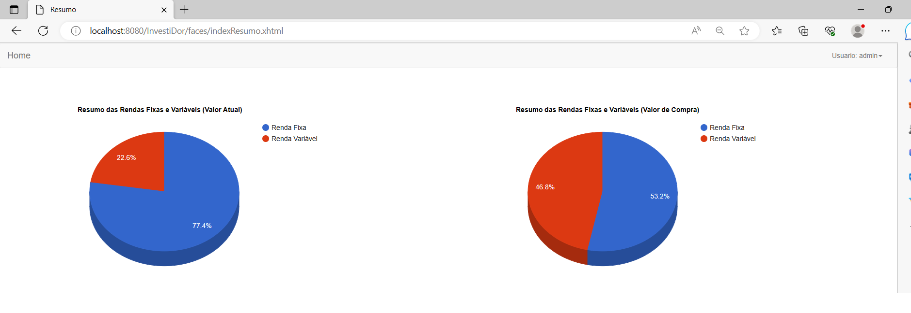
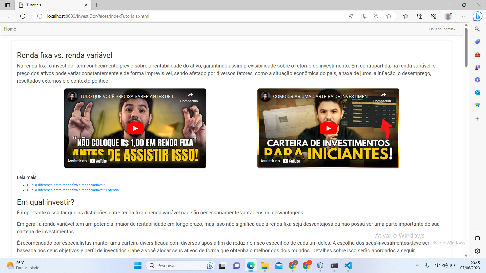
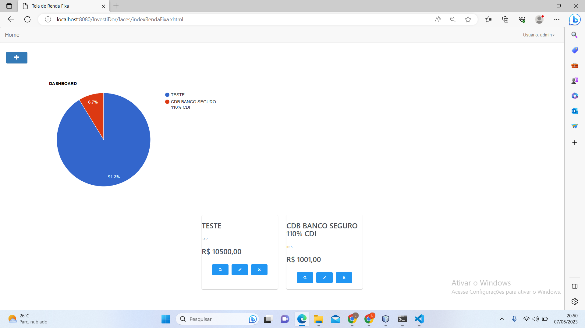
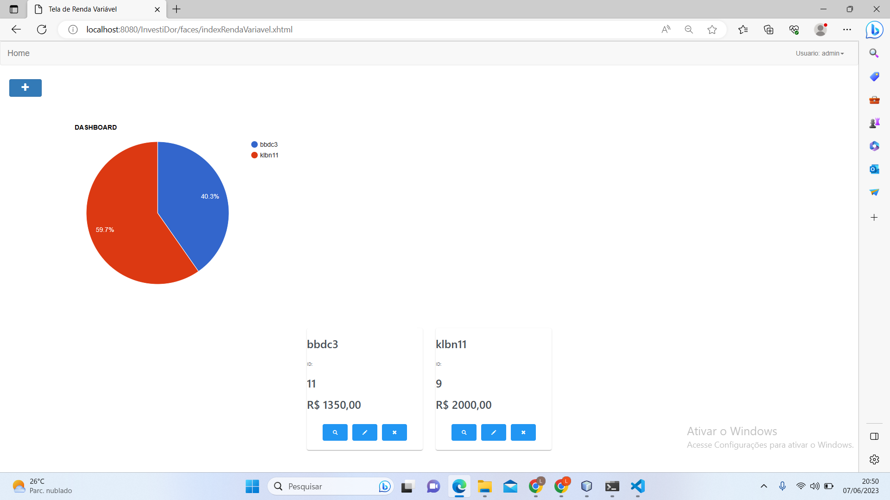

Aqui está o exemplo de um README que inclui as informações solicitadas:

# InvestiDor

O InvestiDor é uma aplicação financeira projetada para investidores que desejam centralizar e visualizar seus investimentos de forma intuitiva e fácil.

## Funcionalidades Principais

- Centralização de Investimentos
- Visualização Intuitiva
- Acompanhamento de Desempenho
- Segurança e Privacidade

## Requisitos do Sistema

- NetBeans 8.2 (ou versão superior)
- MySQL 5.0 (ou versão superior)
- Bibliotecas necessárias instaladas (consulte a seção "Bibliotecas" no repositório)

## Como Contribuir

Se você deseja contribuir para o desenvolvimento do InvestiDor, siga estas etapas:

1. Faça um fork do repositório [InvestiDor](https://github.com/IzavanCorreia/InvestiDor) no GitHub.
2. Clone o repositório forkado em sua máquina local.
3. Realize as alterações e adicione os commits necessários.
4. Faça o push das alterações para o seu fork.
5. Abra um pull request no repositório principal.

Obrigado por contribuir para o InvestiDor!

## Telas do Sistema

- Tela Inicial
  

- Tela Tutorial
  

- Tela de Renda Fixa
  

- Tela de Renda Variável
  

## Design no Canva

Confira o design do InvestiDor no Canva: [Link para o Canva](https://www.canva.com/design/DAFd37APq7s/im4U6vChz1Uq67J7a3S-gA/view)

Sinta-se à vontade para personalizar o README conforme suas necessidades, adicionando mais informações ou ajustando o layout.